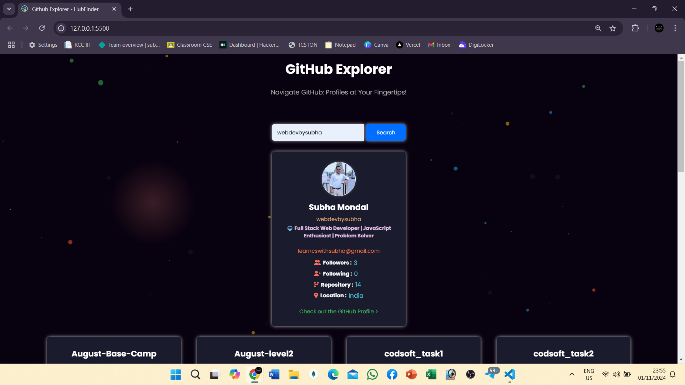

# GitHub Profile Finder

 

## Description
**GitHub Profile Finder** is a web application that allows users to search and explore GitHub profiles effortlessly. With a user-friendly interface, this tool provides quick access to any public GitHub user’s profile data, including repositories, followers, and more.

## Features

| Feature                              | Description                                                                                  |
|--------------------------------------|----------------------------------------------------------------------------------------------|
| 🔍 **User Search**                   | Quickly search for any GitHub user by username.                                             |
| 📊 **Profile Details**               | Displays user information like bio, location, follower count, and more.                      |
| 📁 **Repository List**               | See all public repositories for the user with relevant information.                          |
| 🌐 **Responsive Design**             | Optimized for all devices including desktop, laptop, tablet, and mobile displays.            |
| 🎨 **Animated & Interactive UI**   | Engaging animations, hover effects for a polished user experience.        |

## Tech Stack
- **Frontend**: HTML, CSS, JavaScript
- **API**: GitHub REST API

## Demo
You can try out the app here 👉 [profilefinderhub.vercel.app](https://profilefinderhub.vercel.app/)

## Usage
1. Enter a GitHub username in the search box.
2. Click the **Search** button to fetch user details.
3. Explore the user’s profile, repositories, and additional information.

## License
This project is licensed under the MIT License. See the [LICENSE](./LICENSE) file for details.

## Author
- **Subha Mondal** – [LinkedIn](https://linkedin.com/in/subha-mondal10)

## Acknowledgements
- GitHub REST API for providing easy access to user data.
- Any other libraries, tools, or tutorials you used.

---

Feel free to reach out if you have suggestions, contributions, or just want to say hi! 😊
